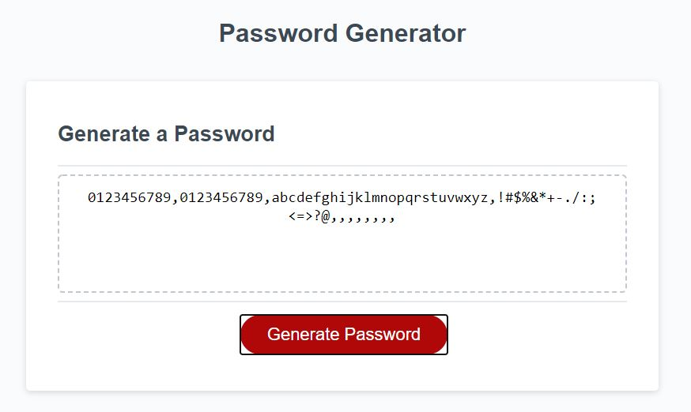
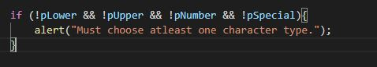
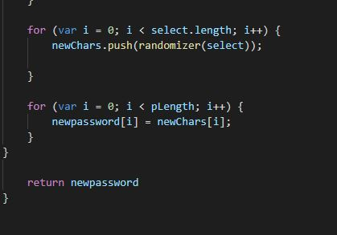

# Password=Generator

A password creator that provides randomized passwords within the users perinmeters. While I wasn't able to produce a fully functional generator, I learned several lessons and had a lot of practice debugging issues.

  

## Table of Contents

* [Tech Used](#tech_used)
* [Usage](#usage)
* [Features](#features)
* [Deployed_Link](#deployed_link)
* [Author](#author)
* [Credits](#credits)
* [License](#license)

----

## Tech Used

* [HTML](https://developer.mozilla.org/en-US/docs/Web/HTML)
* [Javascript](https://developer.mozilla.org/en-US/docs/Web/JavaScript)

## Usage
 
 This generator would be ideal for selecting passwords with different perimeters determined by the user.

## Features

- Conditional logic restricts password to users requirements.
  

- "Randomizer" code produces randon characters from an array.
  

## Deployed Link

* [See Live Site](https://ajhuff7.github.io/portfolio-one/)

---

## Author

**AJ Huff** 

- [Portfolio Site](#)
- [Github](https://github.com/ajhuff7)
- [LinkedIn](https://www.linkedin.com/in/aj-huff-7696b14b/)

## Credits

**Big thank you to all the anonymous inspirations who supported this project... And the Steve Miller Band.**

## License

 